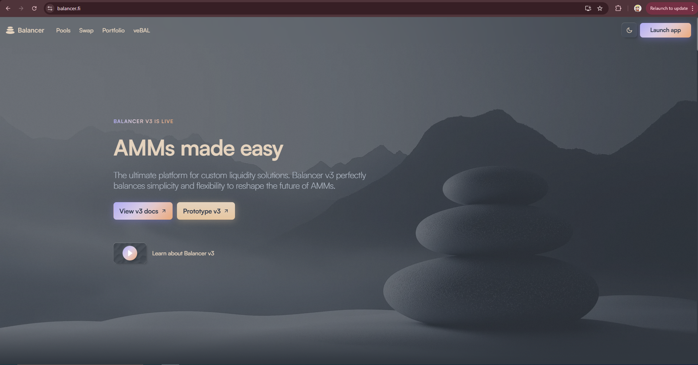

# Balancer Protocol - Deep Dive into v3 Architecture

[LIVE PROJECT](https://balancer.fi/)



Welcome to the **Balancer Explained** repository. This project provides an in-depth exploration of the design, architecture, and inner mechanics of **Balancer v3**, a cutting-edge decentralized automated market maker (AMM) protocol built on Ethereum.

Whether you're an enthusiast eager to understand how Balancer works under the hood, or a developer aiming to build on top of the protocol, this documentation is crafted to help you grasp both high-level concepts and technical nuances.

## 🔍 What is Balancer?

Balancer is a decentralized AMM protocol that enables flexible and capital-efficient trading strategies through customizable liquidity pools. It focuses on supporting fungible and yield-bearing tokens and provides the building blocks for creating innovative DeFi products.

Balancer v3 brings a significant architectural evolution:
- **Vault-centric design:** Core logic is moved from individual pools into a centralized vault, improving gas efficiency and composability.
- **Custom pool support:** Developers can design their own pool logic using predefined interfaces.
- **Hooks and Dynamic Fees:** These features allow extensive customization in trading and liquidity behavior.

## 📦 Features of Balancer v3

- Modular pool architecture for ultimate flexibility.
- Support for custom pools by third-party protocols like **Gyroscope** and **Xave**.
- Gas-optimized vault that handles token transfers, accounting, and authorization centrally.
- Permissionless deployment of pre-audited, production-ready pool types.


## Getting Started

_This project uses `pnpm`, if you haven't already installed it you can find the documentation here:
https://pnpm.io/installation_

To setup the development environment, first clone the repo:

```bash
git clone https://github.com/lorine93s/Balancer.git && cd  Balancer
```

Copy and rename the `.env.example` file to `.env.local`:

```bash
cp .env.example .env.local
```

Next, install dependencies:

```bash
pnpm install
```

Then, run the development server:

```bash
pnpm dev
```

Open [http://localhost:3000](http://localhost:3000) with your browser to see the result.

## Testing

See [TESTING.md](./test/TESTING.md).

## Developing in Windows

To develop in Windows you need to use WSL2. Learn more about it
[here](https://learn.microsoft.com/en-us/windows/wsl/about).

With WSL2 all environment variables will be correctly set without having to use `cross-env`.
